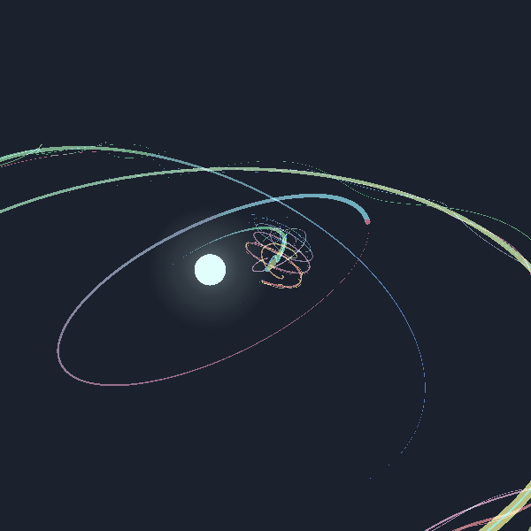

# Procedural-Fake-3D-Planets

A simulation that creates unique star systems everytime.

It was envisioned to run on low-end devices therefore there are no 3D elements in it and all orbits are static to avoid excessive gravitational calculations. Orbits cannot interfere with each other and bodies will never collide.

All celestial bodies are 2D textures masked to shapes that receive translation to simulate planetary rotation. The project also generates continents accordingly to the body size, water level, water and soil color using the Unity 2D Animation package.

It also includes a smooth camera follow system and time control UI.

